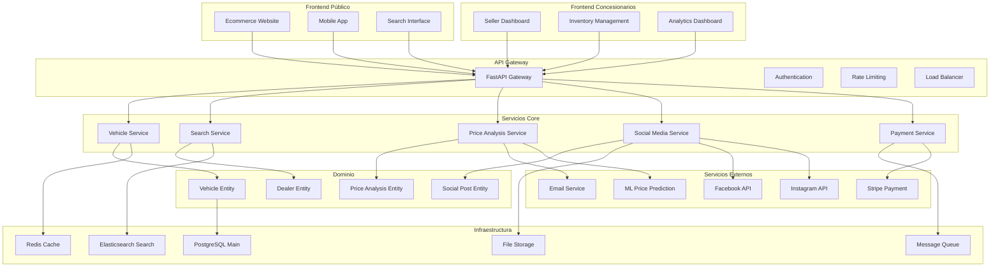

# Documento de Requisitos del Producto: Ecommerce de Vehículos + SaaS de Análisis de Mercado

## 📋 Información del Documento

- **Versión**: 3.0
- **Fecha**: Diciembre 2024
- **Autor**: Product Manager
- **Proyecto**: Ecommerce de Vehículos + SaaS de Análisis
- **Estado**: Borrador para Revisión

---

## 🎯 Resumen Ejecutivo

### Visión del Producto
Desarrollar una **plataforma ecommerce especializada en vehículos** que combine marketplace público con herramientas SaaS de análisis de mercado, permitiendo a concesionarios y vendedores individuales ofrecer sus vehículos al público general mientras obtienen insights valiosos sobre precios, competencia y oportunidades de negocio.

### Objetivos Estratégicos
1. **Ecommerce de Vehículos**: Plataforma pública para venta de vehículos de concesionarios registrados
2. **SaaS de Análisis**: Herramientas avanzadas de análisis de precios y mercado
3. **Gestión de Publicaciones**: Control de publicaciones en redes sociales
4. **Escalabilidad Multi-nicho**: Base para expandir a otros productos
5. **Monetización Dual**: Comisiones por venta + suscripciones SaaS

### Métricas de Éxito
- **Vehículos Publicados**: >10,000 en 6 meses
- **Ventas Mensuales**: >500 vehículos
- **Usuarios SaaS Activos**: >200 concesionarios
- **Retención de Usuarios**: >85% mensual
- **Revenue Mensual**: >$100,000 en 12 meses

---

## 👥 Historias de Usuario

### Epic 1: Ecommerce Público de Vehículos

#### US-001: Catálogo Público de Vehículos
**Como** comprador potencial  
**Quiero** ver todos los vehículos disponibles en la plataforma  
**Para** encontrar el vehículo que necesito

**Criterios de Aceptación:**
- Debo poder ver vehículos de todos los concesionarios registrados
- El sistema debe mostrar imágenes, precio, especificaciones básicas
- Debo poder filtrar por marca, modelo, año, precio, ubicación
- El sistema debe mostrar información del concesionario vendedor
- Debo poder contactar directamente al vendedor

**Estimación**: 13 story points

#### US-002: Buscador Avanzado de Vehículos
**Como** comprador con requisitos específicos  
**Quiero** buscar vehículos con filtros detallados  
**Para** encontrar exactamente lo que necesito

**Criterios de Aceptación:**
- Debo poder filtrar por rango de precios, años, millas
- El sistema debe permitir búsqueda por marca, modelo, color
- Debo poder especificar tipo de combustible (diesel, gasolina, eléctrico)
- El sistema debe permitir búsqueda por tipo de vehículo (sedan, camioneta, van, coupe, hatchback)
- Debo poder buscar por ubicación (estado, ciudad, zip code, área)
- El sistema debe permitir búsquedas guardadas

**Estimación**: 21 story points

#### US-003: Comparador de Precios
**Como** comprador inteligente  
**Quiero** comparar precios de vehículos similares  
**Para** tomar la mejor decisión de compra

**Criterios de Aceptación:**
- Debo poder comparar hasta 5 vehículos lado a lado
- El sistema debe mostrar diferencias de precio, especificaciones y ubicación
- Debo poder ver análisis de si el precio está por encima/abajo del mercado
- El sistema debe sugerir vehículos similares para comparar
- Debo poder exportar comparaciones en PDF

**Estimación**: 17 story points

#### US-004: Proceso de Compra Simplificado
**Como** comprador  
**Quiero** completar la compra de forma sencilla  
**Para** adquirir mi vehículo sin complicaciones

**Criterios de Aceptación:**
- Debo poder solicitar información adicional del vehículo
- El sistema debe permitir programar test drive
- Debo poder hacer ofertas o negociar precio
- El sistema debe facilitar el contacto con el vendedor
- Debo poder guardar vehículos favoritos

**Estimación**: 13 story points

### Epic 2: Gestión de Concesionarios y Vendedores

#### US-005: Registro y Gestión de Concesionarios
**Como** concesionario  
**Quiero** registrar mi negocio en la plataforma  
**Para** vender mis vehículos al público

**Criterios de Aceptación:**
- Debo poder crear perfil de concesionario con información completa
- El sistema debe verificar mi licencia comercial
- Debo poder subir documentos de verificación
- El sistema debe permitir múltiples usuarios por concesionario
- Debo poder personalizar mi perfil y branding

**Estimación**: 8 story points

#### US-006: Gestión de Inventario de Vehículos
**Como** concesionario  
**Quiero** gestionar mi inventario de vehículos  
**Para** mantener mi catálogo actualizado

**Criterios de Aceptación:**
- Debo poder agregar vehículos con especificaciones detalladas
- El sistema debe permitir importar inventario desde CSV/Excel
- Debo poder editar, activar/desactivar vehículos
- El sistema debe calcular precio sugerido basado en análisis de mercado
- Debo poder marcar vehículos como vendidos o reservados
- El sistema debe permitir subir múltiples imágenes por vehículo

**Estimación**: 17 story points

#### US-007: Dashboard de Vendedor
**Como** vendedor/concesionario  
**Quiero** ver métricas de mis ventas y vehículos  
**Para** optimizar mi estrategia de ventas

**Criterios de Aceptación:**
- Debo poder ver estadísticas de visitas a mis vehículos
- El sistema debe mostrar tiempo promedio de venta por vehículo
- Debo poder ver análisis de precios vs competencia
- El sistema debe mostrar leads generados y conversiones
- Debo poder ver reportes de rendimiento mensual/anual

**Estimación**: 13 story points

### Epic 3: Análisis de Precios y Mercado

#### US-008: Análisis de Precios de Mercado
**Como** vendedor  
**Quiero** saber si mis precios están competitivos  
**Para** maximizar mis ventas y ganancias

**Criterios de Aceptación:**
- El sistema debe identificar si vendo por encima/abajo del mercado
- Debo poder ver precio promedio, mediana y percentiles del mercado
- El sistema debe mostrar análisis por marca, modelo, año, millas
- Debo poder ver tendencias de precios en el tiempo
- El sistema debe sugerir precio óptimo basado en análisis de mercado

**Estimación**: 21 story points

#### US-009: Detección de Oportunidades de Compra
**Como** concesionario  
**Quiero** identificar vehículos con precios por debajo del mercado  
**Para** encontrar oportunidades de compra y reventa

**Criterios de Aceptación:**
- El sistema debe detectar vehículos con precios anómalos
- Debo poder ver score de oportunidad por vehículo
- El sistema debe alertar sobre vehículos urgentes de vender
- Debo poder configurar criterios de búsqueda de oportunidades
- El sistema debe mostrar análisis de potencial de ganancia

**Estimación**: 17 story points

#### US-010: Búsquedas Avanzadas para Clientes
**Como** vendedor  
**Quiero** buscar vehículos según requisitos específicos de clientes  
**Para** encontrar exactamente lo que necesitan

**Criterios de Aceptación:**
- Debo poder hacer búsquedas generales (rango de años, marcas, tipos)
- El sistema debe permitir búsquedas específicas (modelo exacto, especificaciones)
- Debo poder guardar búsquedas frecuentes de clientes
- El sistema debe alertar cuando aparezcan vehículos que coincidan
- Debo poder compartir resultados de búsqueda con clientes

**Estimación**: 13 story points

### Epic 4: Gestión de Publicaciones en Redes Sociales

#### US-011: Control de Publicaciones en Redes Sociales
**Como** vendedor  
**Quiero** gestionar las publicaciones de mis vehículos en redes sociales  
**Para** maximizar la visibilidad de mi inventario

**Criterios de Aceptación:**
- Debo poder ver qué vehículos están publicados en cada red social
- El sistema debe mostrar cuántas veces se ha publicado cada vehículo
- Debo poder identificar vehículos nuevos que no se han publicado
- El sistema debe permitir programar publicaciones automáticas
- Debo poder ver métricas de engagement por publicación

**Estimación**: 21 story points

#### US-012: Fuerza de Ventas Digital
**Como** concesionario  
**Quiero** que mi equipo de ventas publique vehículos en sus redes  
**Para** ampliar el alcance de mis ventas

**Criterios de Aceptación:**
- Debo poder asignar vehículos a vendedores específicos
- El sistema debe generar contenido optimizado para cada red social
- Debo poder ver qué vendedor publicó cada vehículo
- El sistema debe trackear leads generados por cada vendedor
- Debo poder configurar comisiones por ventas generadas

**Estimación**: 17 story points

#### US-013: Detección de Precios Engañosos
**Como** administrador del sistema  
**Quiero** detectar publicaciones con precios engañosos  
**Para** mantener la calidad de la plataforma

**Criterios de Aceptación:**
- El sistema debe detectar precios de inicial vs precio total
- Debo poder marcar publicaciones como engañosas
- El sistema debe alertar sobre discrepancias en precios
- Debo poder establecer reglas de validación de precios
- El sistema debe permitir moderación manual de publicaciones

**Estimación**: 13 story points

### Epic 5: Sistema de Suscripciones y Monetización

#### US-014: Planes de Suscripción Flexibles
**Como** administrador del SaaS  
**Quiero** ofrecer diferentes planes según necesidades  
**Para** maximizar la adopción y revenue

**Criterios de Aceptación:**
- Debo poder crear planes mensuales y anuales con descuento
- El sistema debe ofrecer período de prueba gratuito
- Debo poder establecer límites por volumen de vehículos
- El sistema debe permitir upgrades/downgrades de planes
- Debo poder configurar funcionalidades premium por plan

**Estimación**: 13 story points

#### US-015: Comisiones por Ventas
**Como** administrador de la plataforma  
**Quiero** cobrar comisiones por ventas realizadas  
**Para** generar revenue adicional

**Criterios de Aceptación:**
- Debo poder configurar porcentajes de comisión por categoría
- El sistema debe trackear ventas y calcular comisiones automáticamente
- Debo poder generar facturas de comisiones
- El sistema debe permitir diferentes modelos de comisión
- Debo poder ver reportes de revenue por comisiones

**Estimación**: 8 story points

---

## 🔧 Requisitos Funcionales

### RF-001: Ecommerce Público
- **RF-001.1**: Catálogo público de vehículos de concesionarios registrados
- **RF-001.2**: Buscador avanzado con filtros múltiples
- **RF-001.3**: Comparador de precios interactivo
- **RF-001.4**: Sistema de favoritos y búsquedas guardadas
- **RF-001.5**: Proceso de contacto y negociación

### RF-002: Gestión de Concesionarios
- **RF-002.1**: Registro y verificación de concesionarios
- **RF-002.2**: Gestión de inventario con especificaciones detalladas
- **RF-002.3**: Dashboard de métricas de ventas
- **RF-002.4**: Sistema de usuarios múltiples por concesionario
- **RF-002.5**: Importación masiva de inventario

### RF-003: Análisis de Precios Avanzado
- **RF-003.1**: Análisis de precios vs mercado (encima/abajo/promedio)
- **RF-003.2**: Detección de oportunidades de compra/venta
- **RF-003.3**: Búsquedas avanzadas por requisitos específicos
- **RF-003.4**: Métricas por rangos de tiempo (mensual, trimestral, semestral, anual)
- **RF-003.5**: Análisis comparativo por regiones

### RF-004: Gestión de Publicaciones en Redes Sociales
- **RF-004.1**: Control de publicaciones por red social
- **RF-004.2**: Tracking de frecuencia de publicaciones
- **RF-004.3**: Identificación de vehículos no publicados
- **RF-004.4**: Fuerza de ventas digital con comisiones
- **RF-004.5**: Generación automática de contenido optimizado

### RF-005: Detección de Fraudes y Calidad
- **RF-005.1**: Detección de precios engañosos (inicial vs total)
- **RF-005.2**: Sistema de moderación de publicaciones
- **RF-005.3**: Validación automática de precios
- **RF-005.4**: Reportes de calidad de publicaciones
- **RF-005.5**: Sistema de denuncias y revisión

### RF-006: Sistema de Suscripciones
- **RF-006.1**: Planes mensuales y anuales con descuento
- **RF-006.2**: Período de prueba gratuito con funcionalidades limitadas
- **RF-006.3**: Límites por volumen de vehículos
- **RF-006.4**: Funcionalidades premium por plan
- **RF-006.5**: Sistema de comisiones por ventas

### RF-007: Analytics y Reportes
- **RF-007.1**: Métricas totales de vehículos por marca, año, estado
- **RF-007.2**: Análisis de tendencias de precios
- **RF-007.3**: Reportes de rendimiento de ventas
- **RF-007.4**: Exportación en múltiples formatos (PDF, Excel, CSV)
- **RF-007.5**: Dashboard ejecutivo con KPIs clave

### RF-008: Alertas y Notificaciones
- **RF-008.1**: Alertas de precios y oportunidades
- **RF-008.2**: Notificaciones de vehículos que coinciden con búsquedas
- **RF-008.3**: Alertas de precios engañosos
- **RF-008.4**: Notificaciones de vehículos no publicados
- **RF-008.5**: Alertas de cambios en el mercado

---

## 🛡️ Requisitos No Funcionales

### RNF-001: Rendimiento
- **RNF-001.1**: Tiempo de respuesta de búsquedas < 2 segundos
- **RNF-001.2**: Soporte para 10,000 usuarios concurrentes
- **RNF-001.3**: Procesamiento de 100,000 vehículos
- **RNF-001.4**: Tiempo de carga de imágenes < 3 segundos
- **RNF-001.5**: Disponibilidad del 99.9%

### RNF-002: Escalabilidad
- **RNF-002.1**: Arquitectura horizontalmente escalable
- **RNF-002.2**: Soporte para múltiples regiones
- **RNF-002.3**: CDN para imágenes y contenido estático
- **RNF-002.4**: Base de datos distribuida
- **RNF-002.5**: Microservicios independientes

### RNF-003: Seguridad
- **RNF-003.1**: Verificación de identidad de concesionarios
- **RNF-003.2**: Encriptación de datos sensibles
- **RNF-003.3**: Protección contra fraudes
- **RNF-003.4**: Auditoría completa de transacciones
- **RNF-003.5**: Cumplimiento con regulaciones locales

### RNF-004: Usabilidad
- **RNF-004.1**: Interfaz responsive para móviles
- **RNF-004.2**: Búsqueda intuitiva con autocompletado
- **RNF-004.3**: Filtros visuales y fáciles de usar
- **RNF-004.4**: Proceso de compra simplificado
- **RNF-004.5**: Soporte multiidioma (ES, EN)

---

## 🏗️ Arquitectura Propuesta

### Arquitectura Ecommerce + SaaS



### Estructura de Directorios

```
ecommerce-vehicles/
├── domain/                    # Capa de Dominio
│   ├── entities/             # Entidades de negocio
│   │   ├── vehicle.py
│   │   ├── dealer.py
│   │   ├── price_analysis.py
│   │   ├── social_post.py
│   │   └── subscription.py
│   ├── repositories/         # Interfaces de repositorios
│   │   ├── vehicle_repository.py
│   │   ├── dealer_repository.py
│   │   └── price_analysis_repository.py
│   ├── services/            # Servicios de dominio
│   │   ├── price_analysis_service.py
│   │   ├── social_media_service.py
│   │   └── fraud_detection_service.py
│   └── value_objects/       # Objetos de valor
│       ├── vehicle_specs.py
│       ├── price_range.py
│       └── location.py
├── application/              # Capa de Aplicación
│   ├── use_cases/           # Casos de uso
│   │   ├── search_vehicles.py
│   │   ├── manage_inventory.py
│   │   ├── analyze_prices.py
│   │   ├── manage_social_posts.py
│   │   └── process_payments.py
│   ├── dtos/               # Objetos de transferencia
│   │   ├── vehicle_dto.py
│   │   ├── search_request_dto.py
│   │   └── price_analysis_dto.py
│   └── services/           # Servicios de aplicación
│       ├── vehicle_service.py
│       ├── search_service.py
│       └── analytics_service.py
├── infrastructure/           # Capa de Infraestructura
│   ├── repositories/        # Implementaciones de repositorios
│   │   ├── postgresql_vehicle_repository.py
│   │   ├── elasticsearch_search_repository.py
│   │   └── redis_cache_repository.py
│   ├── services/           # Servicios externos
│   │   ├── facebook_api_service.py
│   │   ├── instagram_api_service.py
│   │   ├── stripe_payment_service.py
│   │   └── ml_price_prediction_service.py
│   ├── config/            # Configuración
│   │   ├── database.py
│   │   ├── settings.py
│   │   └── logging.py
│   └── migrations/        # Migraciones de BD
│       └── alembic/
├── interfaces/              # Capa de Interfaces
│   ├── api/               # Controladores API
│   │   ├── public_vehicle_controller.py
│   │   ├── dealer_controller.py
│   │   ├── search_controller.py
│   │   └── analytics_controller.py
│   ├── web/               # Frontend
│   │   ├── public/        # Ecommerce público
│   │   ├── dealer/        # Dashboard de concesionarios
│   │   └── admin/         # Panel de administración
│   └── events/            # Manejadores de eventos
│       └── notification_handlers.py
├── ml/                     # Machine Learning
│   ├── models/            # Modelos de ML
│   ├── training/          # Scripts de entrenamiento
│   └── prediction/        # Servicios de predicción
├── tests/                  # Tests
│   ├── unit/
│   ├── integration/
│   ├── e2e/
│   └── ml/
├── docs/                   # Documentación
├── scripts/               # Scripts de utilidad
└── main.py               # Punto de entrada
```

---

## 📊 Plan de Implementación

### Fase 1: Ecommerce Base (Semanas 1-8)
**Objetivo**: Desarrollar la plataforma ecommerce básica

#### Sprint 1-2: Arquitectura y Base de Datos
- [ ] Configurar arquitectura hexagonal
- [ ] Implementar entidades de dominio
- [ ] Crear base de datos con especificaciones de vehículos
- [ ] Configurar sistema de autenticación

#### Sprint 3-4: Ecommerce Público
- [ ] Desarrollar catálogo público de vehículos
- [ ] Implementar buscador básico
- [ ] Crear páginas de detalle de vehículos
- [ ] Implementar sistema de favoritos

#### Sprint 5-6: Gestión de Concesionarios
- [ ] Desarrollar registro de concesionarios
- [ ] Implementar gestión de inventario
- [ ] Crear dashboard básico de vendedor
- [ ] Configurar sistema de usuarios múltiples

#### Sprint 7-8: Buscador Avanzado
- [ ] Implementar filtros avanzados
- [ ] Crear comparador de precios
- [ ] Desarrollar búsquedas guardadas
- [ ] Implementar sistema de contactos

### Fase 2: Análisis de Precios (Semanas 9-16)
**Objetivo**: Implementar sistema de análisis de precios

#### Sprint 9-10: Análisis Básico
- [ ] Implementar cálculo de precios promedio
- [ ] Crear análisis de precios vs mercado
- [ ] Desarrollar detección de oportunidades
- [ ] Implementar métricas básicas

#### Sprint 11-12: Búsquedas Avanzadas
- [ ] Desarrollar búsquedas por requisitos específicos
- [ ] Implementar análisis por rangos de tiempo
- [ ] Crear comparación por regiones
- [ ] Implementar alertas de precios

#### Sprint 13-14: Machine Learning
- [ ] Desarrollar modelos de predicción de precios
- [ ] Implementar detección de anomalías
- [ ] Crear scoring de oportunidades
- [ ] Configurar pipeline de ML

#### Sprint 15-16: Analytics Avanzado
- [ ] Implementar dashboard de analytics
- [ ] Crear reportes personalizados
- [ ] Desarrollar exportación de datos
- [ ] Implementar métricas ejecutivas

### Fase 3: Gestión de Redes Sociales (Semanas 17-24)
**Objetivo**: Implementar gestión de publicaciones en redes sociales

#### Sprint 17-18: Integración con Redes Sociales
- [ ] Integrar APIs de Facebook e Instagram
- [ ] Implementar gestión de publicaciones
- [ ] Crear tracking de publicaciones
- [ ] Desarrollar generación de contenido

#### Sprint 19-20: Fuerza de Ventas Digital
- [ ] Implementar asignación de vehículos a vendedores
- [ ] Crear sistema de comisiones
- [ ] Desarrollar métricas por vendedor
- [ ] Implementar contenido optimizado

#### Sprint 21-22: Detección de Fraudes
- [ ] Implementar detección de precios engañosos
- [ ] Crear sistema de moderación
- [ ] Desarrollar validación automática
- [ ] Implementar reportes de calidad

#### Sprint 23-24: Optimización y Testing
- [ ] Optimizar rendimiento
- [ ] Implementar tests completos
- [ ] Realizar pruebas de carga
- [ ] Configurar monitoreo

### Fase 4: Monetización y Producción (Semanas 25-32)
**Objetivo**: Implementar monetización y desplegar en producción

#### Sprint 25-26: Sistema de Suscripciones
- [ ] Implementar planes de suscripción
- [ ] Integrar pasarela de pagos
- [ ] Crear sistema de comisiones
- [ ] Configurar facturación

#### Sprint 27-28: Frontend Completo
- [ ] Desarrollar interfaz completa
- [ ] Implementar responsive design
- [ ] Crear onboarding de usuarios
- [ ] Optimizar UX/UI

#### Sprint 29-30: Integración y Testing
- [ ] Integrar todos los servicios
- [ ] Realizar testing completo
- [ ] Optimizar rendimiento
- [ ] Configurar CI/CD

#### Sprint 31-32: Go-Live
- [ ] Despliegue en producción
- [ ] Configurar monitoreo
- [ ] Implementar backup
- [ ] Lanzamiento oficial

---

## 💰 Modelo de Negocio

### Planes de Suscripción

#### Plan Freemium (Gratuito)
- Hasta 10 vehículos en inventario
- Búsquedas básicas
- Análisis de precios limitado
- Sin publicaciones en redes sociales
- Soporte por email

#### Plan Básico ($49/mes o $490/año)
- Hasta 50 vehículos en inventario
- Búsquedas avanzadas
- Análisis completo de precios
- Publicaciones en 2 redes sociales
- Alertas básicas
- Soporte prioritario

#### Plan Profesional ($99/mes o $990/año)
- Hasta 200 vehículos en inventario
- Todas las funcionalidades de búsqueda
- Análisis predictivo con ML
- Publicaciones en 5 redes sociales
- Fuerza de ventas digital
- Reportes avanzados
- Soporte telefónico

#### Plan Enterprise ($199/mes o $1,990/año)
- Vehículos ilimitados
- Todas las funcionalidades
- API completa
- Multi-usuario (hasta 20)
- Integración con sistemas externos
- Soporte 24/7
- Consultoría personalizada

### Comisiones por Ventas
- **Comisión por venta**: 2-5% del valor de la venta
- **Comisión por lead calificado**: $10-50 por lead
- **Comisión por test drive**: $5-20 por test drive

### Métricas de Monetización
- **CAC (Customer Acquisition Cost)**: < $100
- **LTV (Lifetime Value)**: > $2,000
- **Churn Rate**: < 3% mensual
- **Tiempo de Recuperación CAC**: < 6 meses
- **MRR Objetivo**: > $200,000 en 18 meses

---

## 🎯 Criterios de Aceptación del Producto

### Criterios Técnicos
- [ ] Arquitectura hexagonal implementada
- [ ] Cobertura de tests > 90%
- [ ] API REST documentada
- [ ] Sistema multi-tenant funcional
- [ ] Integración con redes sociales
- [ ] Sistema de pagos operativo
- [ ] ML pipeline implementado

### Criterios Funcionales
- [ ] Ecommerce público funcional
- [ ] Buscador avanzado operativo
- [ ] Análisis de precios implementado
- [ ] Gestión de redes sociales
- [ ] Sistema de suscripciones
- [ ] Detección de fraudes
- [ ] Dashboard de analytics

### Criterios de Negocio
- [ ] 100 concesionarios registrados en 6 meses
- [ ] 5,000 vehículos publicados
- [ ] 100 ventas mensuales
- [ ] Revenue mensual > $50,000
- [ ] Retención de usuarios > 85%

---

## 📈 Métricas y KPIs

### Métricas Técnicas
- **Tiempo de respuesta de búsquedas**: < 2 segundos
- **Disponibilidad**: > 99.9%
- **Cobertura de Tests**: > 90%
- **Tiempo de carga de imágenes**: < 3 segundos
- **Uptime**: > 99.5%

### Métricas de Negocio
- **Vehículos Publicados**: > 50,000 en 12 meses
- **Concesionarios Activos**: > 500
- **Ventas Mensuales**: > 1,000 vehículos
- **Revenue Mensual**: > $200,000
- **Tasa de Conversión**: > 5%

### Métricas de Usuario
- **Usuarios Únicos Mensuales**: > 100,000
- **Tiempo en Sitio**: > 5 minutos
- **Tasa de Rebote**: < 40%
- **Satisfacción del Usuario**: > 4.5/5
- **Retención de Concesionarios**: > 90%

---

## 🚀 Próximos Pasos

1. **Validación del Documento**: Revisión con stakeholders
2. **Definición de Stack Tecnológico**: Selección de tecnologías específicas
3. **Diseño de UX/UI**: Creación de wireframes y prototipos
4. **Configuración de Entorno**: Setup de herramientas de desarrollo
5. **Inicio de Fase 1**: Comenzar desarrollo del ecommerce base

---

## 📞 Contacto y Aprobaciones

- **Product Manager**: [Nombre]
- **Tech Lead**: [Nombre]
- **UX/UI Designer**: [Nombre]
- **Data Scientist**: [Nombre]
- **Stakeholders**: [Lista de stakeholders]

**Aprobaciones:**
- [ ] Product Manager
- [ ] Tech Lead
- [ ] Arquitecto de Software
- [ ] UX/UI Designer
- [ ] Data Scientist
- [ ] DevOps Engineer
- [ ] QA Lead

---

*Documento generado el [Fecha] - Versión 3.0* 