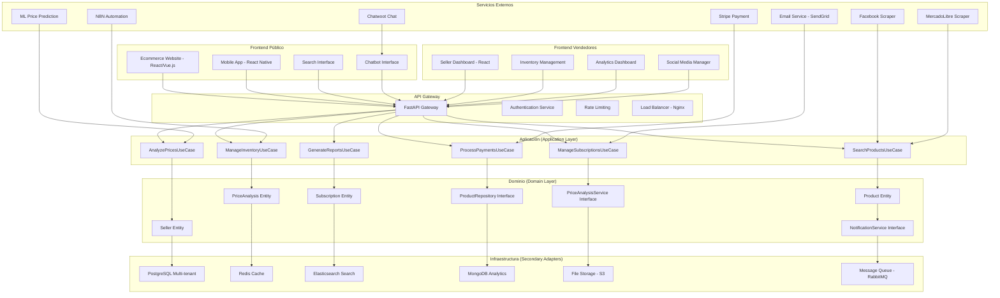
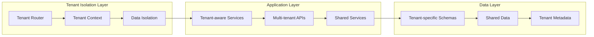

# Arquitectura y Estructura Técnica

## 🏗️ Arquitectura General

### Arquitectura Hexagonal (Clean Architecture)



### Arquitectura Multi-tenant



---

## 📁 Estructura de Directorios

```
ecommerce-multi-product/
│
├── extraction/                    # Extracción y scraping de datos
│   ├── scrapers/
│   │   ├── facebook_marketplace/
│   │   │   ├── scraper.py
│   │   │   ├── scheduler.py
│   │   │   └── utils.py
│   │   ├── mercado_libre/
│   │   │   ├── scraper.py
│   │   │   └── utils.py
│   │   └── base_scraper.py
│   ├── normalization/
│   │   ├── vehicle_mapper.py
│   │   ├── product_mapper.py
│   │   └── data_cleaner.py
│   ├── ingestion/
│   │   ├── api_ingest.py
│   │   ├── batch_processor.py
│   │   └── captcha_resolver.py
│   └── config/
│       ├── scraping_config.py
│       └── sources_config.py
│
├── backend/                       # Backend y lógica de negocio
│   ├── app/
│   │   ├── main.py               # Punto de entrada FastAPI
│   │   ├── api/
│   │   │   ├── v1/
│   │   │   │   ├── products.py
│   │   │   │   ├── sellers.py
│   │   │   │   ├── analytics.py
│   │   │   │   ├── subscriptions.py
│   │   │   │   └── admin.py
│   │   │   └── dependencies.py
│   │   ├── domain/
│   │   │   ├── entities/
│   │   │   │   ├── product.py
│   │   │   │   ├── seller.py
│   │   │   │   ├── price_analysis.py
│   │   │   │   ├── subscription.py
│   │   │   │   └── tenant.py
│   │   │   ├── repositories/
│   │   │   │   ├── product_repository.py
│   │   │   │   ├── seller_repository.py
│   │   │   │   └── price_analysis_repository.py
│   │   │   ├── services/
│   │   │   │   ├── price_analysis_service.py
│   │   │   │   ├── recommendation_service.py
│   │   │   │   └── notification_service.py
│   │   │   └── value_objects/
│   │   │       ├── price.py
│   │   │       ├── product_specs.py
│   │   │       └── location.py
│   │   ├── application/
│   │   │   ├── use_cases/
│   │   │   │   ├── search_products.py
│   │   │   │   ├── analyze_prices.py
│   │   │   │   ├── manage_inventory.py
│   │   │   │   ├── generate_reports.py
│   │   │   │   ├── process_payments.py
│   │   │   │   └── manage_subscriptions.py
│   │   │   ├── dtos/
│   │   │   │   ├── product_dto.py
│   │   │   │   ├── search_request_dto.py
│   │   │   │   └── price_analysis_dto.py
│   │   │   └── services/
│   │   │       ├── product_service.py
│   │   │       ├── analytics_service.py
│   │   │       └── subscription_service.py
│   │   ├── infrastructure/
│   │   │   ├── repositories/
│   │   │   │   ├── postgresql_product_repository.py
│   │   │   │   ├── postgresql_seller_repository.py
│   │   │   │   ├── redis_cache_repository.py
│   │   │   │   └── elasticsearch_search_repository.py
│   │   │   ├── services/
│   │   │   │   ├── stripe_payment_service.py
│   │   │   │   ├── email_notification_service.py
│   │   │   │   ├── ml_price_prediction_service.py
│   │   │   │   └── social_media_service.py
│   │   │   ├── config/
│   │   │   │   ├── database.py
│   │   │   │   ├── settings.py
│   │   │   │   ├── multi_tenant.py
│   │   │   │   └── logging.py
│   │   │   └── migrations/
│   │   │       └── alembic/
│   │   │           ├── versions/
│   │   │           ├── env.py
│   │   │           └── alembic.ini
│   │   └── shared/
│   │       ├── exceptions/
│   │       ├── utils/
│   │       └── constants/
│   ├── tests/
│   │   ├── unit/
│   │   ├── integration/
│   │   ├── e2e/
│   │   └── fixtures/
│   └── requirements.txt
│
├── frontend/                      # Frontend (React/Vue.js)
│   ├── public/                    # Ecommerce público
│   │   ├── src/
│   │   │   ├── components/
│   │   │   │   ├── ProductCard/
│   │   │   │   ├── SearchFilters/
│   │   │   │   ├── PriceComparison/
│   │   │   │   └── Chatbot/
│   │   │   ├── pages/
│   │   │   │   ├── Home/
│   │   │   │   ├── ProductDetail/
│   │   │   │   ├── SearchResults/
│   │   │   │   └── Contact/
│   │   │   ├── services/
│   │   │   │   ├── api/
│   │   │   │   ├── auth/
│   │   │   │   └── analytics/
│   │   │   ├── hooks/
│   │   │   ├── utils/
│   │   │   └── styles/
│   │   ├── public/
│   │   ├── package.json
│   │   └── README.md
│   ├── dealer/                    # Dashboard de vendedores
│   │   ├── src/
│   │   │   ├── components/
│   │   │   │   ├── Dashboard/
│   │   │   │   ├── Inventory/
│   │   │   │   ├── Analytics/
│   │   │   │   └── SocialMedia/
│   │   │   ├── pages/
│   │   │   │   ├── Dashboard/
│   │   │   │   ├── Inventory/
│   │   │   │   ├── Analytics/
│   │   │   │   └── Settings/
│   │   │   ├── services/
│   │   │   └── utils/
│   │   ├── package.json
│   │   └── README.md
│   └── admin/                     # Panel de administración
│       ├── src/
│       │   ├── components/
│       │   ├── pages/
│       │   ├── services/
│       │   └── utils/
│       ├── package.json
│       └── README.md
│
├── ml/                           # Machine Learning
│   ├── models/
│   │   ├── price_prediction/
│   │   │   ├── model.py
│   │   │   ├── train.py
│   │   │   └── predict.py
│   │   ├── recommendation/
│   │   │   ├── collaborative_filtering.py
│   │   │   ├── content_based.py
│   │   │   └── hybrid.py
│   │   ├── sentiment_analysis/
│   │   │   ├── model.py
│   │   │   └── analyzer.py
│   │   └── anomaly_detection/
│   │       ├── model.py
│   │       └── detector.py
│   ├── training/
│   │   ├── data_preparation.py
│   │   ├── feature_engineering.py
│   │   ├── model_training.py
│   │   └── evaluation.py
│   ├── prediction/
│   │   ├── price_prediction_service.py
│   │   ├── recommendation_service.py
│   │   └── sentiment_service.py
│   ├── data/
│   │   ├── raw/
│   │   ├── processed/
│   │   └── models/
│   └── notebooks/
│       ├── exploratory_analysis.ipynb
│       ├── model_development.ipynb
│       └── evaluation.ipynb
│
├── automation/                    # Automatización con N8N
│   ├── workflows/
│   │   ├── lead_management/
│   │   │   ├── lead_capture.json
│   │   │   ├── lead_scoring.json
│   │   │   └── lead_assignment.json
│   │   ├── social_media/
│   │   │   ├── auto_posting.json
│   │   │   ├── engagement_tracking.json
│   │   │   └── content_generation.json
│   │   ├── notifications/
│   │   │   ├── price_alerts.json
│   │   │   ├── opportunity_alerts.json
│   │   │   └── system_alerts.json
│   │   └── analytics/
│   │       ├── report_generation.json
│   │       ├── data_sync.json
│   │       └── performance_monitoring.json
│   ├── custom_nodes/
│   │   ├── ai_analysis/
│   │   ├── price_prediction/
│   │   └── sentiment_analysis/
│   └── config/
│       ├── n8n_config.json
│       └── webhooks.json
│
├── integrations/                  # Integraciones externas
│   ├── chatwoot/
│   │   ├── config/
│   │   ├── webhooks/
│   │   └── custom_scripts/
│   ├── crm/
│   │   ├── suitecrm/
│   │   ├── sugarcrm/
│   │   ├── vtiger/
│   │   ├── odoo/
│   │   ├── dolibarr/
│   │   └── baserow/
│   ├── social_media/
│   │   ├── facebook/
│   │   ├── instagram/
│   │   ├── whatsapp/
│   │   └── telegram/
│   └── payment/
│       ├── stripe/
│       ├── paypal/
│       └── local_payment/
│
├── infrastructure/                # Infraestructura
│   ├── docker/
│   │   ├── docker-compose.yml
│   │   ├── Dockerfile.backend
│   │   ├── Dockerfile.frontend
│   │   └── nginx/
│   ├── kubernetes/
│   │   ├── deployments/
│   │   ├── services/
│   │   ├── configmaps/
│   │   └── secrets/
│   ├── terraform/
│   │   ├── main.tf
│   │   ├── variables.tf
│   │   └── outputs.tf
│   └── monitoring/
│       ├── prometheus/
│       ├── grafana/
│       └── alertmanager/
│
├── docs/                         # Documentación
│   ├── api/
│   │   ├── openapi.yaml
│   │   └── postman_collection.json
│   ├── architecture/
│   │   ├── system_design.md
│   │   ├── database_schema.md
│   │   └── api_design.md
│   ├── deployment/
│   │   ├── installation.md
│   │   ├── configuration.md
│   │   └── troubleshooting.md
│   └── user_guides/
│       ├── seller_guide.md
│       ├── admin_guide.md
│       └── api_guide.md
│
├── scripts/                      # Scripts de utilidad
│   ├── deployment/
│   │   ├── deploy.sh
│   │   ├── backup.sh
│   │   └── restore.sh
│   ├── database/
│   │   ├── migrate.sh
│   │   ├── seed.sh
│   │   └── backup.sh
│   ├── monitoring/
│   │   ├── health_check.sh
│   │   └── performance_test.sh
│   └── utils/
│       ├── data_import.sh
│       ├── cleanup.sh
│       └── maintenance.sh
│
├── .github/                      # CI/CD
│   ├── workflows/
│   │   ├── ci.yml
│   │   ├── cd.yml
│   │   └── security.yml
│   └── actions/
├── .gitignore
├── README.md
├── docker-compose.yml
└── Makefile
```

---

## 🛠️ Stack Tecnológico

### Backend
- **Framework**: FastAPI (Python 3.11+)
- **Base de Datos Principal**: PostgreSQL 15+
- **Cache**: Redis 7+
- **Búsqueda**: Elasticsearch 8+
- **Message Queue**: RabbitMQ 3.12+
- **ORM**: SQLAlchemy 2.0+
- **Migraciones**: Alembic
- **Autenticación**: JWT con PyJWT
- **Validación**: Pydantic 2.0+
- **Testing**: pytest, pytest-asyncio
- **Documentación**: OpenAPI/Swagger

### Frontend
- **Framework**: React 18+ con TypeScript
- **Estado**: Redux Toolkit o Zustand
- **UI Library**: Material-UI o Ant Design
- **Routing**: React Router 6+
- **HTTP Client**: Axios o React Query
- **Testing**: Jest, React Testing Library
- **Build Tool**: Vite o Webpack
- **Linting**: ESLint, Prettier

### Machine Learning
- **Framework**: TensorFlow 2.x o PyTorch
- **Librerías**: scikit-learn, pandas, numpy
- **Procesamiento de Lenguaje**: Transformers, spaCy
- **Visualización**: Matplotlib, Seaborn, Plotly
- **Experimentación**: MLflow, Weights & Biases
- **Despliegue**: TensorFlow Serving, TorchServe

### Infraestructura
- **Contenedores**: Docker, Docker Compose
- **Orquestación**: Kubernetes
- **Infraestructura como Código**: Terraform
- **CI/CD**: GitHub Actions
- **Monitoreo**: Prometheus, Grafana
- **Logging**: ELK Stack (Elasticsearch, Logstash, Kibana)
- **CDN**: Cloudflare o AWS CloudFront
- **Cloud**: AWS, GCP, o Azure

### Integraciones
- **Automatización**: N8N
- **Chat**: Chatwoot
- **CRM**: SuiteCRM, SugarCRM, vTiger, Odoo, Dolibarr, Baserow
- **Pagos**: Stripe, PayPal
- **Email**: SendGrid, AWS SES
- **SMS**: Twilio, AWS SNS
- **Redes Sociales**: Facebook Graph API, Instagram API, WhatsApp Business API

### Herramientas de Desarrollo
- **IDE**: VS Code, PyCharm
- **Control de Versiones**: Git, GitHub
- **Gestión de Dependencias**: Poetry (Python), npm/yarn (Node.js)
- **Documentación**: Sphinx, Storybook
- **Testing**: pytest, Jest, Cypress
- **Code Quality**: SonarQube, CodeClimate

---

## 🔄 Patrones de Diseño

### Arquitectura Hexagonal
```python
# Ejemplo de implementación
from abc import ABC, abstractmethod
from dataclasses import dataclass
from typing import List, Optional

# Dominio
@dataclass
class Product:
    id: str
    name: str
    price: float
    seller_id: str

class ProductRepository(ABC):
    @abstractmethod
    async def save(self, product: Product) -> Product:
        pass
    
    @abstractmethod
    async def find_by_id(self, product_id: str) -> Optional[Product]:
        pass

# Aplicación
@dataclass
class SearchProductsRequest:
    query: str
    filters: dict
    page: int
    size: int

class SearchProductsUseCase:
    def __init__(self, product_repository: ProductRepository):
        self.product_repository = product_repository
    
    async def execute(self, request: SearchProductsRequest) -> List[Product]:
        # Lógica de negocio
        pass

# Infraestructura
class PostgreSQLProductRepository(ProductRepository):
    def __init__(self, database_connection):
        self.db = database_connection
    
    async def save(self, product: Product) -> Product:
        # Implementación con PostgreSQL
        pass
    
    async def find_by_id(self, product_id: str) -> Optional[Product]:
        # Implementación con PostgreSQL
        pass
```

### Multi-tenancy
```python
# Ejemplo de implementación multi-tenant
from contextvars import ContextVar
from typing import Optional

tenant_context: ContextVar[Optional[str]] = ContextVar('tenant_id', default=None)

class TenantMiddleware:
    async def __call__(self, request, call_next):
        tenant_id = request.headers.get('X-Tenant-ID')
        if tenant_id:
            tenant_context.set(tenant_id)
        response = await call_next(request)
        return response

class TenantAwareRepository:
    def __init__(self, base_repository):
        self.base_repository = base_repository
    
    def get_tenant_filter(self):
        tenant_id = tenant_context.get()
        if tenant_id:
            return {"tenant_id": tenant_id}
        return {}
```

---

## 📊 Modelo de Datos

### Esquema Principal
```sql
-- Tabla de Tenants
CREATE TABLE tenants (
    id UUID PRIMARY KEY DEFAULT gen_random_uuid(),
    name VARCHAR(255) NOT NULL,
    domain VARCHAR(255) UNIQUE,
    settings JSONB,
    created_at TIMESTAMP DEFAULT NOW(),
    updated_at TIMESTAMP DEFAULT NOW()
);

-- Tabla de Vendedores
CREATE TABLE sellers (
    id UUID PRIMARY KEY DEFAULT gen_random_uuid(),
    tenant_id UUID REFERENCES tenants(id),
    name VARCHAR(255) NOT NULL,
    email VARCHAR(255) UNIQUE NOT NULL,
    phone VARCHAR(50),
    address JSONB,
    verification_status VARCHAR(50) DEFAULT 'pending',
    created_at TIMESTAMP DEFAULT NOW(),
    updated_at TIMESTAMP DEFAULT NOW()
);

-- Tabla de Productos
CREATE TABLE products (
    id UUID PRIMARY KEY DEFAULT gen_random_uuid(),
    tenant_id UUID REFERENCES tenants(id),
    seller_id UUID REFERENCES sellers(id),
    external_id VARCHAR(255), -- ID del scraping
    name VARCHAR(500) NOT NULL,
    description TEXT,
    price DECIMAL(10,2),
    original_price DECIMAL(10,2),
    category VARCHAR(100),
    subcategory VARCHAR(100),
    specifications JSONB,
    images JSONB,
    status VARCHAR(50) DEFAULT 'active',
    source VARCHAR(50), -- 'scraped', 'manual', 'api'
    created_at TIMESTAMP DEFAULT NOW(),
    updated_at TIMESTAMP DEFAULT NOW()
);

-- Tabla de Análisis de Precios
CREATE TABLE price_analyses (
    id UUID PRIMARY KEY DEFAULT gen_random_uuid(),
    product_id UUID REFERENCES products(id),
    market_price DECIMAL(10,2),
    price_percentile INTEGER,
    price_trend VARCHAR(50),
    confidence_score DECIMAL(3,2),
    analysis_date TIMESTAMP DEFAULT NOW(),
    created_at TIMESTAMP DEFAULT NOW()
);

-- Tabla de Suscripciones
CREATE TABLE subscriptions (
    id UUID PRIMARY KEY DEFAULT gen_random_uuid(),
    tenant_id UUID REFERENCES tenants(id),
    plan_type VARCHAR(50) NOT NULL,
    status VARCHAR(50) DEFAULT 'active',
    start_date TIMESTAMP NOT NULL,
    end_date TIMESTAMP,
    features JSONB,
    created_at TIMESTAMP DEFAULT NOW(),
    updated_at TIMESTAMP DEFAULT NOW()
);
```

---

*Documento de Arquitectura y Estructura Técnica - Versión 4.0* 