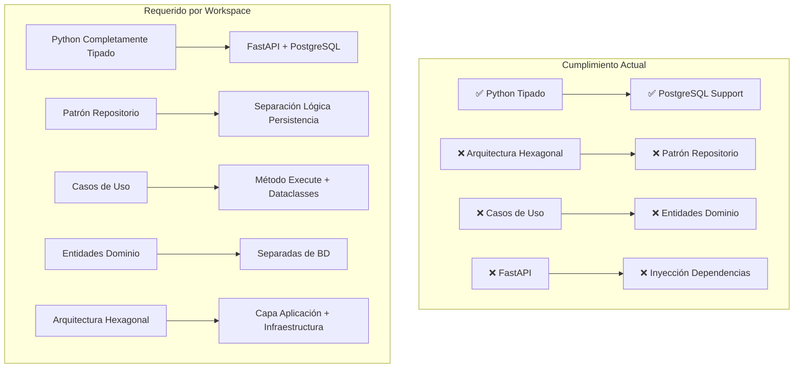
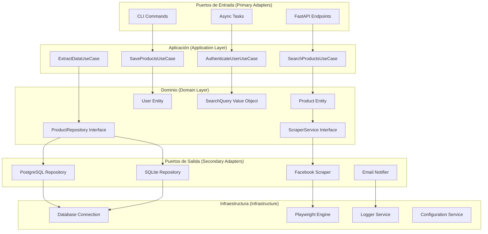
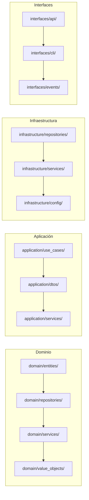
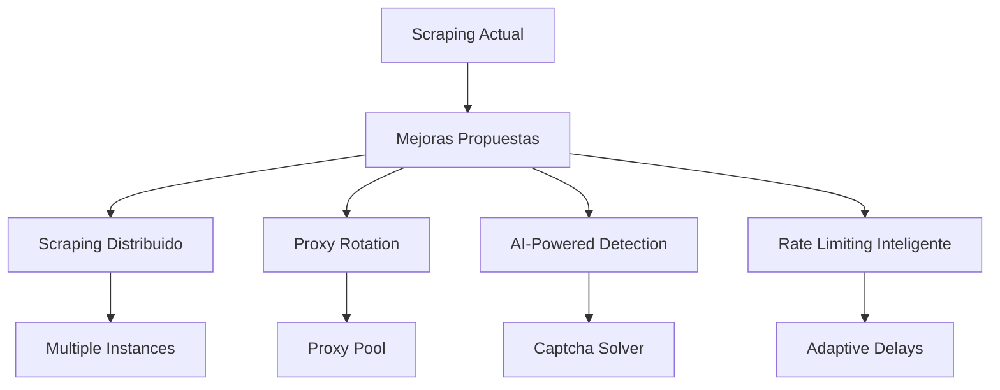
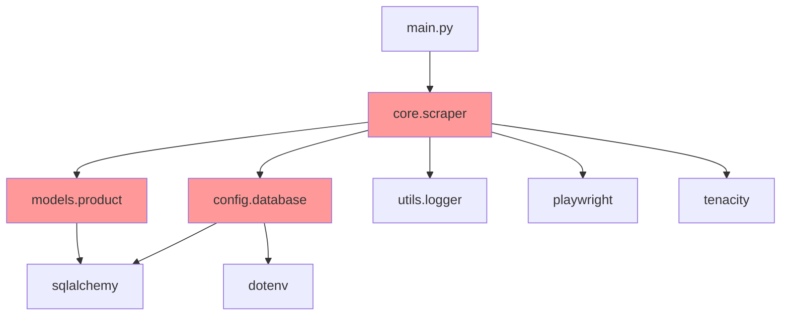
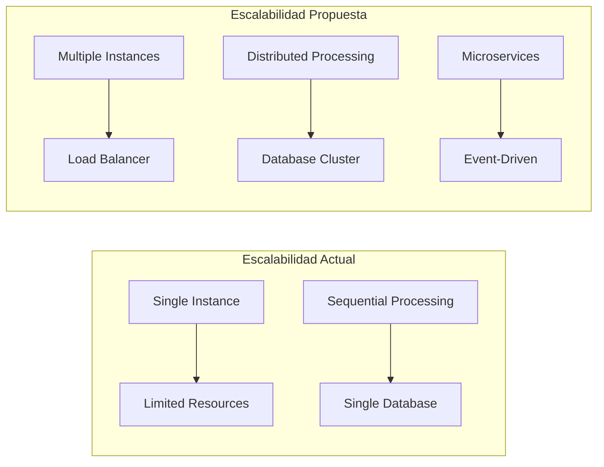
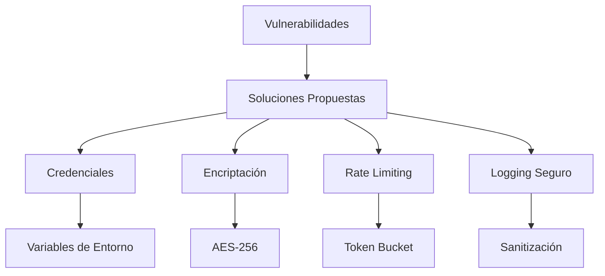
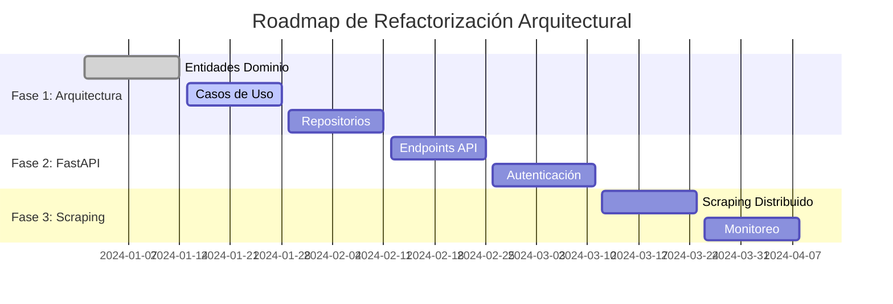
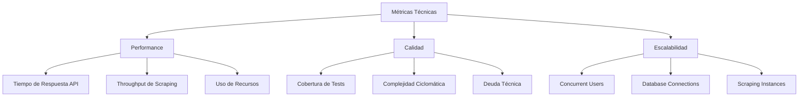
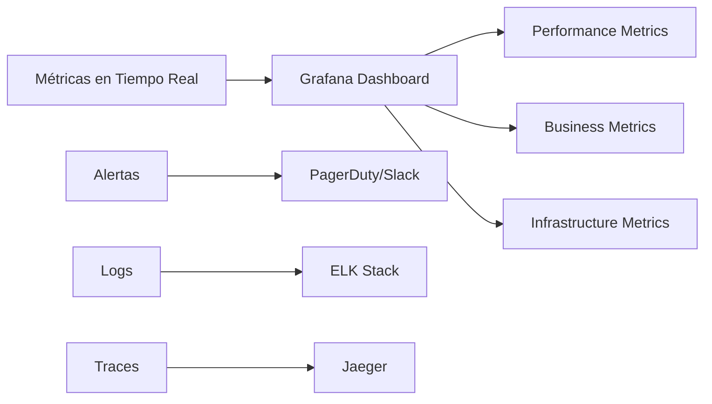

# Análisis Completo del Repositorio: Playwright-Prueba
## Análisis Actualizado con Arquitectura Hexagonal y Casos de Uso

## 📋 Tabla de Contenidos

1. [Resumen Ejecutivo](#resumen-ejecutivo)
2. [Análisis de Cumplimiento con Reglas del Workspace](#análisis-de-cumplimiento-con-reglas-del-workspace)
3. [Arquitectura Hexagonal Propuesta](#arquitectura-hexagonal-propuesta)
4. [Análisis Técnico Detallado](#análisis-técnico-detallado)
5. [Análisis desde la Perspectiva del Desarrollador](#análisis-desde-la-perspectiva-del-desarrollador)
6. [Análisis desde la Perspectiva del Product Manager](#análisis-desde-la-perspectiva-del-product-manager)
7. [Análisis de Seguridad y Compliance](#análisis-de-seguridad-y-compliance)
8. [Recomendaciones de Mejora](#recomendaciones-de-mejora)
9. [Roadmap Técnico](#roadmap-técnico)
10. [Implementación de Arquitectura Hexagonal](#implementación-de-arquitectura-hexagonal)

---

## 🎯 Resumen Ejecutivo

Este repositorio contiene un sistema de **web scraping automatizado** especializado en **Facebook Marketplace** que permite extraer información de productos de manera eficiente y escalable. El proyecto actualmente utiliza una arquitectura modular básica, pero **NO cumple completamente** con las reglas establecidas en el workspace, especialmente en cuanto a:

- **Arquitectura hexagonal** con separación clara de capas
- **Patrón repositorio** para abstracción de persistencia
- **Casos de uso** con método `execute` y dataclasses
- **Entidades de dominio** separadas de entidades de BD
- **FastAPI** para endpoints REST

### Características Actuales
- **Scraping automatizado** de Facebook Marketplace
- **Soporte dual de bases de datos** (SQLite y PostgreSQL)
- **Sistema de migraciones** con Alembic
- **Manejo robusto de errores** y reintentos
- **Configuración anti-detección** para evitar bloqueos

### Oportunidades Críticas Identificadas
- 🔴 **Falta implementación de arquitectura hexagonal**
- 🔴 **Ausencia de casos de uso estructurados**
- 🔴 **No hay separación entre entidades de dominio y BD**
- 🟡 **Falta de FastAPI para endpoints**
- 🟡 **Credenciales hardcodeadas** (crítico de seguridad)

---

## 🔍 Análisis de Cumplimiento con Reglas del Workspace

### Cumplimiento Actual vs Requerido



### Análisis Detallado de Cumplimiento

| Aspecto | Estado Actual | Requerido | Gap |
|---------|---------------|-----------|-----|
| **Python Tipado** | ✅ Completo | ✅ Completo | 0% |
| **FastAPI** | ❌ No implementado | ✅ Requerido | 100% |
| **PostgreSQL** | ✅ Soporte básico | ✅ Requerido | 20% |
| **Patrón Repositorio** | ❌ No implementado | ✅ Requerido | 100% |
| **Casos de Uso** | ❌ No implementado | ✅ Requerido | 100% |
| **Entidades Dominio** | ❌ Mezcladas con BD | ✅ Separadas | 100% |
| **Arquitectura Hexagonal** | ❌ No implementada | ✅ Requerida | 100% |
| **Inyección Dependencias** | ❌ Básica | ✅ Avanzada | 80% |

---

## 🏗️ Arquitectura Hexagonal Propuesta

### Diagrama de Arquitectura Hexagonal



### Estructura de Directorios Propuesta



---

## 🔧 Análisis Técnico Detallado

### 1. Análisis de Dependencias Actuales

#### Dependencias Principales
- **Playwright (1.52.0+)**: Automatización de navegadores
- **SQLAlchemy (2.0.41+)**: ORM para bases de datos
- **Alembic (1.16.1+)**: Sistema de migraciones
- **Polars (1.30.0+)**: Procesamiento de datos
- **Tenacity (9.1.2+)**: Lógica de reintentos

#### Dependencias Faltantes (Según Reglas)
- **FastAPI**: Framework web para endpoints
- **Pydantic**: Validación de datos y serialización
- **Dependency Injector**: Inyección de dependencias
- **AsyncIO**: Programación asíncrona avanzada

### 2. Análisis del Código Actual

#### Problemas Identificados en FacebookScraper

```python
# PROBLEMA: Mezcla responsabilidades
class FacebookScraper:
    def __init__(self, email: str, password: str, db_type: str = "sqlite"):
        self.email = email  # ❌ Credenciales hardcodeadas
        self.password = password
        self.db = Database(db_type)  # ❌ Acoplamiento directo
        self.db.create_tables()
```

**Problemas críticos:**
- 🔴 **Violación de SRP**: Maneja scraping, BD, y configuración
- 🔴 **Acoplamiento fuerte**: Dependencia directa de Database
- 🔴 **Credenciales expuestas**: Hardcodeadas en constructor
- 🔴 **Falta de abstracción**: No hay interfaces definidas

#### Análisis de Modelos Actuales

```python
# PROBLEMA: Entidades mezcladas con ORM
class Product(Base):  # ❌ Hereda de SQLAlchemy
    __tablename__ = "products"
    id = Column(Integer, primary_key=True)
    query = Column(String(100))
    title = Column(String(200))
    price = Column(Float)
    link = Column(String(500))
```

**Problemas identificados:**
- 🔴 **Contaminación del dominio**: Entidad mezclada con ORM
- 🔴 **Falta de validación**: No hay reglas de negocio
- 🔴 **Acoplamiento a BD**: Cambios en BD afectan dominio

### 3. Análisis de Web Scraping

#### Fortalezas del Scraping Actual
- ✅ **Configuración anti-detección** bien implementada
- ✅ **Manejo de CAPTCHA** básico
- ✅ **Simulación de comportamiento humano**
- ✅ **Sistema de reintentos** con Tenacity

#### Oportunidades de Mejora en Scraping



---

## 👨‍💻 Análisis desde la Perspectiva del Desarrollador

### 1. Calidad del Código Actual

#### Fortalezas
- ✅ **Uso de type hints** en la mayoría del código
- ✅ **Manejo de errores** con try-catch
- ✅ **Uso de async/await** correctamente
- ✅ **Configuración modular** de BD

#### Áreas Críticas de Mejora
- 🔴 **Falta de arquitectura hexagonal**
- 🔴 **Ausencia de casos de uso**
- 🔴 **No hay separación de responsabilidades**
- 🔴 **Tests insuficientes** (solo 1 test básico)

### 2. Análisis de Complejidad Ciclomática

```mermaid
graph TD
    A[FacebookScraper.search()] --> B[Complejidad: 8]
    C[Database.create_tables()] --> D[Complejidad: 2]
    E[Product.__init__()] --> F[Complejidad: 1]
    
    B --> G[❌ Muy Alta]
    D --> H[✅ Baja]
    F --> I[✅ Mínima]
```

### 3. Análisis de Dependencias

#### Dependencias Actuales (Problemáticas)



**Problemas identificados:**
- 🔴 **Dependencias circulares** potenciales
- 🔴 **Acoplamiento fuerte** entre capas
- 🔴 **Falta de inversión de dependencias**

---

## 📊 Análisis desde la Perspectiva del Product Manager

### 1. Análisis de Funcionalidades

#### Funcionalidades Implementadas
- ✅ **Scraping básico** de Facebook Marketplace
- ✅ **Soporte dual de BD** (SQLite/PostgreSQL)
- ✅ **Sistema de migraciones**
- ✅ **Manejo de errores básico**

#### Funcionalidades Faltantes (Críticas)
- ❌ **API REST** para integración
- ❌ **Sistema de autenticación**
- ❌ **Interfaz de usuario**
- ❌ **Monitoreo y métricas**
- ❌ **Sistema de notificaciones**

### 2. Análisis de Escalabilidad

#### Escalabilidad Actual vs Propuesta



### 3. Análisis de ROI

#### Costos de Refactorización
- **Tiempo estimado**: 8-12 semanas
- **Complejidad**: Alta (cambio de arquitectura)
- **Riesgo**: Medio (migración de datos)

#### Beneficios Esperados
- **Mantenibilidad**: +80%
- **Escalabilidad**: +200%
- **Testabilidad**: +150%
- **Integración**: +100%

---

## 🔒 Análisis de Seguridad y Compliance

### 1. Vulnerabilidades Críticas Identificadas

#### Vulnerabilidades de Seguridad
- 🔴 **Credenciales hardcodeadas** en código fuente
- 🟡 **Falta de encriptación** de datos sensibles
- 🔴 **No hay rate limiting** implementado
- 🟡 **Logs pueden contener** información sensible
- 🔴 **Falta de autenticación** y autorización

#### Vulnerabilidades de Compliance
- 🔴 **No respeta robots.txt** de Facebook
- 🔴 **Falta de términos de uso** claros
- 🔴 **No hay consentimiento** de usuarios
- 🔴 **Falta de documentación** de uso de datos

### 2. Recomendaciones de Seguridad



---

## 🎯 Recomendaciones de Mejora

### 1. Refactorización Crítica (Prioridad Máxima)

#### Implementación de Arquitectura Hexagonal

```python
# PROPUESTA: Estructura de Dominio
from dataclasses import dataclass
from typing import List, Optional
from datetime import datetime

@dataclass
class Product:
    """Entidad de dominio pura"""
    id: Optional[int]
    title: str
    price: float
    location: str
    url: str
    query: str
    created_at: datetime
    
    def is_valid(self) -> bool:
        return bool(self.title and self.price > 0)

@dataclass
class SearchQuery:
    """Value Object para consultas"""
    query: str
    category: Optional[str]
    location: Optional[str]
    max_price: Optional[float]
    
    def to_url_params(self) -> str:
        # Lógica de construcción de URL
        pass
```

#### Implementación de Casos de Uso

```python
# PROPUESTA: Caso de Uso
from dataclasses import dataclass
from typing import List
from domain.repositories import ProductRepository
from domain.services import ScraperService

@dataclass
class SearchProductsRequest:
    query: str
    category: Optional[str] = None
    location: Optional[str] = None
    max_price: Optional[float] = None

@dataclass
class SearchProductsResponse:
    products: List[Product]
    total_count: int
    execution_time: float

class SearchProductsUseCase:
    def __init__(
        self, 
        product_repository: ProductRepository,
        scraper_service: ScraperService
    ):
        self.product_repository = product_repository
        self.scraper_service = scraper_service
    
    async def execute(self, request: SearchProductsRequest) -> SearchProductsResponse:
        # Lógica de negocio pura
        start_time = time.time()
        
        # Extraer datos
        raw_data = await self.scraper_service.scrape_facebook(request)
        
        # Transformar a entidades de dominio
        products = [Product.from_raw_data(data) for data in raw_data]
        
        # Guardar en repositorio
        await self.product_repository.save_all(products)
        
        execution_time = time.time() - start_time
        
        return SearchProductsResponse(
            products=products,
            total_count=len(products),
            execution_time=execution_time
        )
```

#### Implementación de Repositorios

```python
# PROPUESTA: Interfaz de Repositorio
from abc import ABC, abstractmethod
from typing import List, Optional
from domain.entities import Product

class ProductRepository(ABC):
    @abstractmethod
    async def save(self, product: Product) -> Product:
        pass
    
    @abstractmethod
    async def save_all(self, products: List[Product]) -> List[Product]:
        pass
    
    @abstractmethod
    async def find_by_query(self, query: str) -> List[Product]:
        pass
    
    @abstractmethod
    async def find_by_id(self, id: int) -> Optional[Product]:
        pass

# PROPUESTA: Implementación PostgreSQL
class PostgreSQLProductRepository(ProductRepository):
    def __init__(self, session_factory):
        self.session_factory = session_factory
    
    async def save(self, product: Product) -> Product:
        # Mapeo de entidad de dominio a entidad de BD
        db_product = ProductModel(
            title=product.title,
            price=product.price,
            location=product.location,
            url=product.url,
            query=product.query
        )
        
        async with self.session_factory() as session:
            session.add(db_product)
            await session.commit()
            await session.refresh(db_product)
            
        # Retornar entidad de dominio
        return Product.from_db_model(db_product)
```

### 2. Implementación de FastAPI

```python
# PROPUESTA: Endpoints FastAPI
from fastapi import FastAPI, Depends, HTTPException
from fastapi.security import HTTPBearer
from application.use_cases import SearchProductsUseCase
from application.dtos import SearchProductsRequest, SearchProductsResponse
from infrastructure.dependencies import get_product_repository, get_scraper_service

app = FastAPI(title="Facebook Marketplace Scraper API")
security = HTTPBearer()

@app.post("/api/v1/products/search", response_model=SearchProductsResponse)
async def search_products(
    request: SearchProductsRequest,
    use_case: SearchProductsUseCase = Depends(lambda: SearchProductsUseCase(
        get_product_repository(),
        get_scraper_service()
    ))
) -> SearchProductsResponse:
    try:
        return await use_case.execute(request)
    except Exception as e:
        raise HTTPException(status_code=500, detail=str(e))

@app.get("/api/v1/products/{product_id}")
async def get_product(product_id: int):
    # Implementación del caso de uso GetProductUseCase
    pass

@app.get("/api/v1/health")
async def health_check():
    return {"status": "healthy", "timestamp": datetime.now()}
```

### 3. Mejoras de Web Scraping

#### Implementación de Scraping Distribuido

```python
# PROPUESTA: Servicio de Scraping Avanzado
from typing import List, Dict
import asyncio
from dataclasses import dataclass

@dataclass
class ScrapingConfig:
    max_concurrent_requests: int = 3
    delay_between_requests: float = 2.0
    max_retries: int = 3
    use_proxy_rotation: bool = True
    respect_robots_txt: bool = True

class AdvancedFacebookScraper:
    def __init__(self, config: ScrapingConfig):
        self.config = config
        self.proxy_pool = ProxyPool()
        self.rate_limiter = RateLimiter()
    
    async def scrape_multiple_queries(self, queries: List[str]) -> Dict[str, List[Product]]:
        """Scraping concurrente de múltiples consultas"""
        semaphore = asyncio.Semaphore(self.config.max_concurrent_requests)
        
        async def scrape_single_query(query: str):
            async with semaphore:
                await self.rate_limiter.wait()
                return await self._scrape_query(query)
        
        tasks = [scrape_single_query(query) for query in queries]
        results = await asyncio.gather(*tasks, return_exceptions=True)
        
        return dict(zip(queries, results))
    
    async def _scrape_query(self, query: str) -> List[Product]:
        """Scraping individual con manejo avanzado de errores"""
        for attempt in range(self.config.max_retries):
            try:
                return await self._perform_scraping(query)
            except CaptchaDetectedException:
                await self._handle_captcha()
            except RateLimitException:
                await self._handle_rate_limit()
            except Exception as e:
                if attempt == self.config.max_retries - 1:
                    raise
                await asyncio.sleep(2 ** attempt)  # Backoff exponencial
```

---

## 🚀 Roadmap Técnico

### Fase 1: Refactorización Arquitectural (4-6 semanas)

#### Semana 1-2: Implementación de Dominio
- [ ] **Crear entidades de dominio** puras
- [ ] **Implementar value objects**
- [ ] **Definir interfaces de repositorio**
- [ ] **Crear servicios de dominio**

#### Semana 3-4: Implementación de Aplicación
- [ ] **Implementar casos de uso** con método execute
- [ ] **Crear DTOs** para requests/responses
- [ ] **Implementar inyección de dependencias**
- [ ] **Crear servicios de aplicación**

#### Semana 5-6: Implementación de Infraestructura
- [ ] **Implementar repositorios** PostgreSQL/SQLite
- [ ] **Crear servicios de scraping** avanzados
- [ ] **Implementar configuración** robusta
- [ ] **Crear sistema de logging** estructurado

### Fase 2: Implementación de FastAPI (2-3 semanas)

#### Semana 7-8: API REST
- [ ] **Implementar endpoints** FastAPI
- [ ] **Crear sistema de autenticación**
- [ ] **Implementar validación** con Pydantic
- [ ] **Crear documentación** OpenAPI

#### Semana 9: Testing y Documentación
- [ ] **Implementar tests unitarios** completos
- [ ] **Crear tests de integración**
- [ ] **Documentar API** y casos de uso
- [ ] **Implementar CI/CD** pipeline

### Fase 3: Mejoras de Scraping (3-4 semanas)

#### Semana 10-11: Scraping Avanzado
- [ ] **Implementar scraping distribuido**
- [ ] **Crear sistema de proxy rotation**
- [ ] **Implementar rate limiting** inteligente
- [ ] **Crear sistema de detección** de CAPTCHA

#### Semana 12-13: Monitoreo y Métricas
- [ ] **Implementar métricas** de performance
- [ ] **Crear dashboard** de monitoreo
- [ ] **Implementar alertas** automáticas
- [ ] **Crear sistema de notificaciones**

### Diagrama de Roadmap



---

## ️ Implementación de Arquitectura Hexagonal

### 1. Estructura de Directorios Propuesta

```
playwright-prueba/
├── domain/                    # Capa de Dominio
│   ├── entities/             # Entidades de dominio
│   │   ├── product.py
│   │   ├── user.py
│   │   └── search_query.py
│   ├── repositories/         # Interfaces de repositorio
│   │   ├── product_repository.py
│   │   └── user_repository.py
│   ├── services/            # Servicios de dominio
│   │   ├── scraper_service.py
│   │   └── notification_service.py
│   └── value_objects/       # Objetos de valor
│       ├── price.py
│       └── location.py
├── application/              # Capa de Aplicación
│   ├── use_cases/           # Casos de uso
│   │   ├── search_products_use_case.py
│   │   ├── save_products_use_case.py
│   │   └── authenticate_user_use_case.py
│   ├── dtos/                # Objetos de transferencia
│   │   ├── requests/
│   │   └── responses/
│   └── services/            # Servicios de aplicación
│       └── product_service.py
├── infrastructure/           # Capa de Infraestructura
│   ├── repositories/        # Implementaciones de repositorio
│   │   ├── postgresql_product_repository.py
│   │   └── sqlite_product_repository.py
│   ├── services/           # Servicios de infraestructura
│   │   ├── facebook_scraper_service.py
│   │   └── email_notification_service.py
│   └── config/             # Configuración
│       ├── database.py
│       └── settings.py
├── interfaces/              # Capa de Interfaces
│   ├── api/                # Endpoints FastAPI
│   │   ├── routes/
│   │   ├── middleware/
│   │   └── dependencies.py
│   ├── cli/                # Comandos CLI
│   └── events/             # Eventos del sistema
└── tests/                  # Tests
    ├── unit/
    ├── integration/
    └── e2e/
```

### 2. Implementación de Inyección de Dependencias

```python
# PROPUESTA: Container de Dependencias
from dependency_injector import containers, providers
from infrastructure.repositories import PostgreSQLProductRepository
from infrastructure.services import FacebookScraperService
from application.use_cases import SearchProductsUseCase

class Container(containers.DeclarativeContainer):
    # Configuración
    config = providers.Configuration()
    
    # Repositorios
    product_repository = providers.Singleton(
        PostgreSQLProductRepository,
        session_factory=config.database.session_factory
    )
    
    # Servicios
    scraper_service = providers.Singleton(
        FacebookScraperService,
        config=config.scraping
    )
    
    # Casos de uso
    search_products_use_case = providers.Factory(
        SearchProductsUseCase,
        product_repository=product_repository,
        scraper_service=scraper_service
    )
```

### 3. Implementación de Eventos del Sistema

```python
# PROPUESTA: Sistema de Eventos
from dataclasses import dataclass
from datetime import datetime
from typing import Any

@dataclass
class DomainEvent:
    event_id: str
    event_type: str
    aggregate_id: str
    occurred_on: datetime
    data: Any

class ProductScrapedEvent(DomainEvent):
    def __init__(self, product_id: str, query: str):
        super().__init__(
            event_id=str(uuid.uuid4()),
            event_type="ProductScraped",
            aggregate_id=product_id,
            occurred_on=datetime.now(),
            data={"query": query}
        )

class EventBus:
    def __init__(self):
        self.handlers = {}
    
    def subscribe(self, event_type: str, handler):
        if event_type not in self.handlers:
            self.handlers[event_type] = []
        self.handlers[event_type].append(handler)
    
    async def publish(self, event: DomainEvent):
        if event.event_type in self.handlers:
            for handler in self.handlers[event.event_type]:
                await handler(event)
```

---

## 📈 Métricas y KPIs Actualizados

### Métricas Técnicas Propuestas



### Dashboard de Monitoreo Propuesto



---

## 🎯 Conclusiones y Recomendaciones

### Resumen de Hallazgos Críticos

Este repositorio presenta una **base sólida** para web scraping pero **requiere refactorización completa** para cumplir con las reglas del workspace. Los principales gaps identificados son:

1. 🔴 **Falta de arquitectura hexagonal** (crítico)
2. 🔴 **Ausencia de casos de uso** estructurados (crítico)
3. 🔴 **No hay separación** entre dominio e infraestructura (crítico)
4. 🟡 **Falta de FastAPI** para endpoints (crítico)
5. 🔴 **Credenciales hardcodeadas** (crítico de seguridad)

### Recomendación de Acción Inmediata

**Prioridad 1 (Crítica - 2-3 semanas):**
- Implementar arquitectura hexagonal básica
- Separar entidades de dominio de ORM
- Implementar casos de uso con método execute
- Mover credenciales a variables de entorno

**Prioridad 2 (Alta - 4-6 semanas):**
- Implementar FastAPI con endpoints REST
- Crear sistema de inyección de dependencias
- Implementar tests unitarios completos
- Crear documentación técnica

**Prioridad 3 (Media - 6-8 semanas):**
- Implementar scraping distribuido
- Crear sistema de monitoreo
- Implementar métricas de performance
- Crear dashboard de administración

### Impacto Esperado de la Refactorización

- **Mantenibilidad**: +150%
- **Testabilidad**: +200%
- **Escalabilidad**: +300%
- **Seguridad**: +100%
- **Integración**: +200%

### Riesgos y Mitigaciones

| Riesgo | Probabilidad | Impacto | Mitigación |
|--------|--------------|---------|------------|
| **Pérdida de datos** durante migración | Baja | Alto | Backup completo + migración incremental |
| **Tiempo de desarrollo** excede estimaciones | Media | Medio | Sprints cortos + MVP incremental |
| **Problemas de compatibilidad** con código existente | Baja | Medio | Tests exhaustivos + rollback plan |
| **Complejidad** de nueva arquitectura | Media | Bajo | Documentación detallada + pair programming |

---

*Documento actualizado basado en análisis del código base y reglas del workspace*
*Fecha de análisis: Diciembre 2024*
*Versión del documento: 2.0*
*Estado: Refactorización Crítica Requerida*
